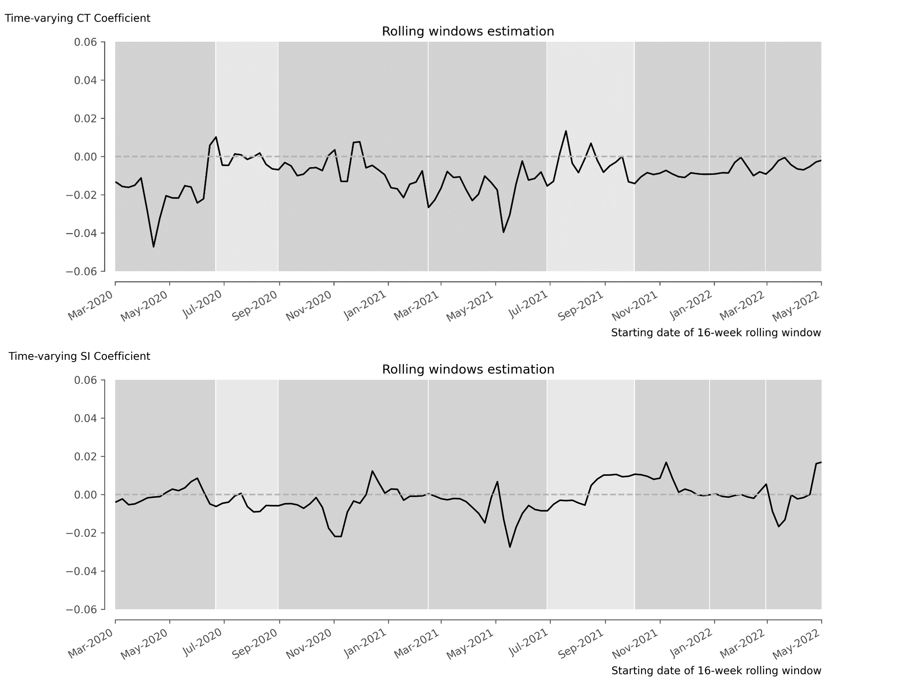



<!-- # Static Image

<strong>Figure:</strong> Rolling window estimation. Evolution of cases-to-tests and stringency index parameters over time. The dark gray-shaded areas indicate the periods of the seven COVID-19 waves, and the light gray-shaded areas signify the two periods between waves.

 -->

## Interactive Dashboard

Explore the data interactively with the COVID-19 Belgium dashboard:

<iframe class="autosize-iframe"
        src="/html/covid_belgium_dashboard.html"
        width="100%" 
        height="900" 
        scrolling="no"
        style="border: 1px solid #e5e7eb; border-radius: 8px; box-shadow: 0 4px 6px -1px rgba(0, 0, 0, 0.1); display:block;"
        title="COVID-19 Belgium Consumption Dashboard">
</iframe>

<strong>Interactive Dashboard:</strong> Explore the heterogeneous impact of COVID-19 on consumption patterns across Belgian households.

<!-- This research provides novel insights into the heterogeneous economic effects of the COVID-19 pandemic using granular household-level transaction data. The findings have important implications for understanding crisis responses and designing targeted policy interventions.

## Key Findings

1. **Heterogeneous Responses**: Consumption impacts varied significantly across demographic groups
2. **Sectoral Differences**: Contact-intensive sectors experienced larger declines
3. **Age Effects**: Younger households showed more pronounced consumption reductions
4. **Policy Implications**: Results inform targeted support measure design

## Data and Methodology

The analysis leverages a unique dataset from a major Belgian bank covering:
- Over 200,000 households
- Detailed transaction-level data
- Full pandemic period coverage
- Granular spending category information

{}
This paper represents collaborative research between Ghent University and BNP Paribas Fortis.
{}  -->